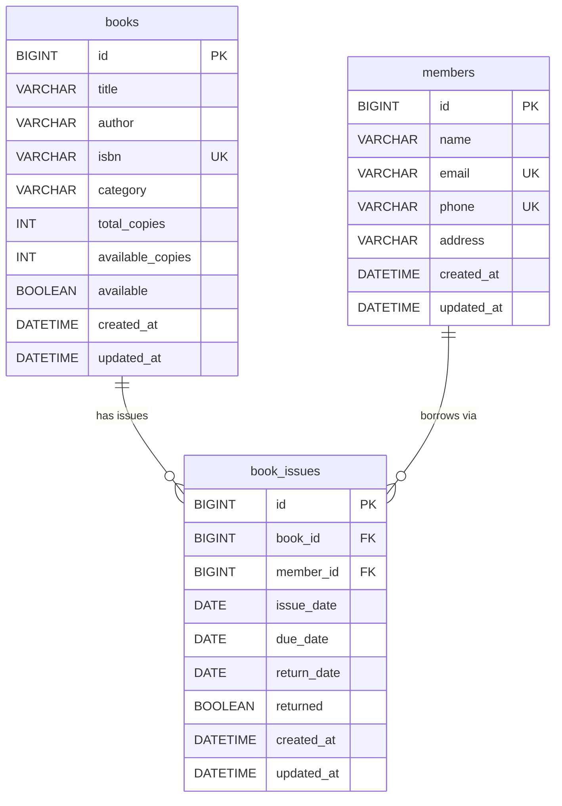

# Library Book Issue & Return Management System

A full-stack library management application with React frontend, Spring Boot backend, and MySQL database.

## Tech Stack

| Layer | Technologies |
|-------|-------------|
| Frontend | React 18, Vite, Tailwind CSS, Axios, React Router, React Toastify, Context API |
| Backend | Java 21, Spring Boot 3.2, Spring Data JPA, MySQL, Lombok, Validation, Swagger |
| Database | MySQL 8 |

## Project Structure

```
hclmock/
├── backend/          # Spring Boot REST API
├── frontend/         # React + Vite UI
├── postman/          # Postman collection
└── README.md
```

## Database Schema

**Database name:** `library_management`

The system uses three tables. `book_issues` is the junction/transaction table that links `books` and `members` and records each issue and return.

### Entity Relationship Diagram



### Table Relationships

| From Table   | To Table     | Relationship | Foreign Key   | Description |
|--------------|--------------|--------------|---------------|-------------|
| `book_issues`| `books`      | Many-to-One  | `book_id` → `books.id` | Each issue record belongs to one book. One book can have many issue records over time (history of all issues/returns). |
| `book_issues`| `members`    | Many-to-One  | `member_id` → `members.id` | Each issue record belongs to one member. One member can have many issue records (current and past borrows). |

**Cardinality summary:**

- **books (1) ──→ (N) book_issues** — One book can appear in many issue rows (re-issued after return).
- **members (1) ──→ (N) book_issues** — One member can have many issue rows (up to 3 active at a time per business rule).
- **books ↔ members** — Connected only through `book_issues` (no direct FK between books and members).

### Table: `books`

Stores the library catalog and copy availability.

| Column            | Type           | Constraints        | Description |
|-------------------|----------------|--------------------|-------------|
| `id`              | BIGINT         | PK, AUTO_INCREMENT | Unique book record ID |
| `title`           | VARCHAR(200)   | NOT NULL           | Book title |
| `author`          | VARCHAR(100)   | NOT NULL           | Author name |
| `isbn`            | VARCHAR(17)    | NOT NULL, UNIQUE   | International Standard Book Number |
| `category`        | VARCHAR(50)    | NOT NULL           | Genre/category (e.g. Programming) |
| `total_copies`    | INT            | NOT NULL           | Total copies owned by the library |
| `available_copies`| INT            | NOT NULL           | Copies currently available to issue |
| `available`       | BOOLEAN        | NOT NULL, DEFAULT TRUE | `TRUE` when `available_copies > 0` |
| `created_at`      | DATETIME       | NOT NULL           | Record creation timestamp |
| `updated_at`      | DATETIME       | NULL               | Last update timestamp |

### Table: `members`

Stores registered library members.

| Column       | Type           | Constraints        | Description |
|--------------|----------------|--------------------|-------------|
| `id`         | BIGINT         | PK, AUTO_INCREMENT | Unique member ID |
| `name`       | VARCHAR(100)   | NOT NULL           | Full name |
| `email`      | VARCHAR(255)   | NOT NULL, UNIQUE   | Email address |
| `phone`      | VARCHAR(10)    | NOT NULL, UNIQUE   | 10-digit phone number |
| `address`    | VARCHAR(255)   | NOT NULL           | Residential address |
| `created_at` | DATETIME       | NOT NULL           | Registration timestamp |
| `updated_at` | DATETIME       | NULL               | Last update timestamp |

### Table: `book_issues`

Stores book issue and return transactions. Links `books` and `members`.

| Column        | Type     | Constraints        | Description |
|---------------|----------|--------------------|-------------|
| `id`          | BIGINT   | PK, AUTO_INCREMENT | Unique issue record ID |
| `book_id`     | BIGINT   | NOT NULL, FK       | References `books.id` |
| `member_id`   | BIGINT   | NOT NULL, FK       | References `members.id` |
| `issue_date`  | DATE     | NOT NULL           | Date the book was issued |
| `due_date`    | DATE     | NOT NULL           | Expected return date |
| `return_date` | DATE     | NULL               | Actual return date (NULL while active) |
| `returned`    | BOOLEAN  | NOT NULL, DEFAULT FALSE | `FALSE` = active issue, `TRUE` = returned |
| `created_at`  | DATETIME | NOT NULL           | Record creation timestamp |
| `updated_at`  | DATETIME | NULL               | Last update timestamp |

**Foreign keys:**

```sql
FOREIGN KEY (book_id)   REFERENCES books(id)
FOREIGN KEY (member_id) REFERENCES members(id)
```

### Full SQL Schema

```sql
CREATE DATABASE IF NOT EXISTS library_management;
USE library_management;

CREATE TABLE IF NOT EXISTS books (
    id BIGINT AUTO_INCREMENT PRIMARY KEY,
    title VARCHAR(200) NOT NULL,
    author VARCHAR(100) NOT NULL,
    isbn VARCHAR(17) NOT NULL UNIQUE,
    category VARCHAR(50) NOT NULL,
    total_copies INT NOT NULL,
    available_copies INT NOT NULL,
    available BOOLEAN NOT NULL DEFAULT TRUE,
    created_at DATETIME NOT NULL,
    updated_at DATETIME
);

CREATE TABLE IF NOT EXISTS members (
    id BIGINT AUTO_INCREMENT PRIMARY KEY,
    name VARCHAR(100) NOT NULL,
    email VARCHAR(255) NOT NULL UNIQUE,
    phone VARCHAR(10) NOT NULL UNIQUE,
    address VARCHAR(255) NOT NULL,
    created_at DATETIME NOT NULL,
    updated_at DATETIME
);

CREATE TABLE IF NOT EXISTS book_issues (
    id BIGINT AUTO_INCREMENT PRIMARY KEY,
    book_id BIGINT NOT NULL,
    member_id BIGINT NOT NULL,
    issue_date DATE NOT NULL,
    due_date DATE NOT NULL,
    return_date DATE,
    returned BOOLEAN NOT NULL DEFAULT FALSE,
    created_at DATETIME NOT NULL,
    updated_at DATETIME,
    CONSTRAINT fk_book_issues_book
        FOREIGN KEY (book_id) REFERENCES books(id),
    CONSTRAINT fk_book_issues_member
        FOREIGN KEY (member_id) REFERENCES members(id)
);
```

### Relationship Flow (Example)

```
books (id=1, "Clean Code")
    │
    └── book_issues (id=1, book_id=1, member_id=1, returned=FALSE)  ← active issue
            │
            └── members (id=1, "John Doe")
```

When the book is returned, `book_issues.returned` becomes `TRUE`, `return_date` is set, and `books.available_copies` is incremented.

## Prerequisites

- Java 21 JDK
- Maven 3.8+
- Node.js 18+ and npm
- MySQL 8 running on localhost:3306

## MySQL Setup

1. Start MySQL server
2. Create the database:

```sql
CREATE DATABASE IF NOT EXISTS library_management;
```

3. Optional: Run sample schema and data from `backend/src/main/resources/schema.sql`

**Note:** Hibernate `ddl-auto=update` will auto-create tables on first backend startup.

### Database Credentials (application.properties)

- URL: `jdbc:mysql://localhost:3306/library_management`
- Username: `root`
- Password: `Aniket@123`

## Backend Setup & Run

```bash
cd backend
mvn clean install
mvn spring-boot:run
```

Backend runs at: **http://localhost:8080**

- Swagger UI: http://localhost:8080/swagger-ui.html
- API Docs: http://localhost:8080/api-docs

## Frontend Setup & Run

```bash
cd frontend
npm install
npm run dev
```

Frontend runs at: **http://localhost:5173**

## API Endpoints

### Books
| Method | Endpoint | Description |
|--------|----------|-------------|
| POST | `/api/books` | Add book |
| GET | `/api/books` | Get all books |
| GET | `/api/books/available` | Get available books |
| GET | `/api/books/title/{title}` | Search by title |
| GET | `/api/books/author/{author}` | Search by author |
| PUT | `/api/books/{id}` | Update book |
| DELETE | `/api/books/{id}` | Delete book |

### Members
| Method | Endpoint | Description |
|--------|----------|-------------|
| POST | `/api/members` | Register member |
| GET | `/api/members` | Get all members |
| GET | `/api/members/by-email/{email}` | Get member by email (member login) |
| GET | `/api/members/{id}` | Get member details |
| PUT | `/api/members/{id}` | Update member |
| DELETE | `/api/members/{id}` | Delete member |
| GET | `/api/members/{id}/books` | Get member's issued books |

### Issues
| Method | Endpoint | Description |
|--------|----------|-------------|
| POST | `/api/issues/issue` | Issue book |
| PUT | `/api/issues/return/{issueId}` | Return book |
| GET | `/api/issues` | Get all issues |
| GET | `/api/issues/active` | Get active issues |

### Dashboard
| Method | Endpoint | Description |
|--------|----------|-------------|
| GET | `/api/dashboard/stats` | Get dashboard statistics |

## Sample JSON Requests

### Add Book
```json
{
  "title": "Clean Code",
  "author": "Robert Martin",
  "isbn": "978-0132350884",
  "category": "Programming",
  "totalCopies": 3
}
```

### Register Member
```json
{
  "name": "John Doe",
  "email": "john.doe@email.com",
  "phone": "9876543210",
  "address": "123 Main Street, City"
}
```

### Issue Book
```json
{
  "bookId": 1,
  "memberId": 1,
  "dueDate": "2026-06-15"
}
```

## Business Rules

- One book copy can only be issued to one member at a time
- A member can issue maximum 3 books
- Book must be available before issuing
- Returning a book marks it available again
- Duplicate active issues for same book+member are prevented

## Actors & Login

The application supports two roles with separate dashboards:

| Actor | Login | Dashboard URL | Capabilities |
|-------|-------|---------------|--------------|
| **Librarian** | Click "Enter as Librarian" on login page | `/librarian` | Full admin: manage books, members, issue/return books |
| **Library Member** | Enter registered email on login page | `/member` | Browse books, view issued books, update profile |

### How to test both roles

1. Start backend and frontend
2. Open http://localhost:5173 — you will see the **Login** page
3. **Librarian:** Click **Enter as Librarian**
4. **Member:** First register a member as librarian (or use sample data email `john.doe@email.com`), then logout and login with that email

### Member Portal Pages

1. **Dashboard** — personal stats, active/overdue books, quick links
2. **Browse Books** — view and search available books
3. **My Books** — all issued books with due dates and status
4. **My Profile** — view and edit member details

## Frontend Pages (Librarian)

1. **Dashboard** - Total books, available books, issued books, total members
2. **Books** - CRUD, search by title/author
3. **Members** - CRUD, view issued books
4. **Issue Management** - Issue book, return book, active issues table
5. **404** - Not found page

## API Testing

1. Import `postman/Library-Management-API.postman_collection.json` into Postman
2. Ensure backend is running on port 8080
3. Run requests in order: Add Book → Register Member → Issue Book → Return Book

## CORS

CORS is configured to allow requests from `http://localhost:5173`.

## Troubleshooting

| Issue | Solution |
|-------|----------|
| MySQL connection refused | Ensure MySQL is running and credentials match `application.properties` |
| Port 8080 in use | Change `server.port` in application.properties |
| CORS errors | Verify frontend runs on port 5173 |
| npm install fails | Use Node.js 18+ |
